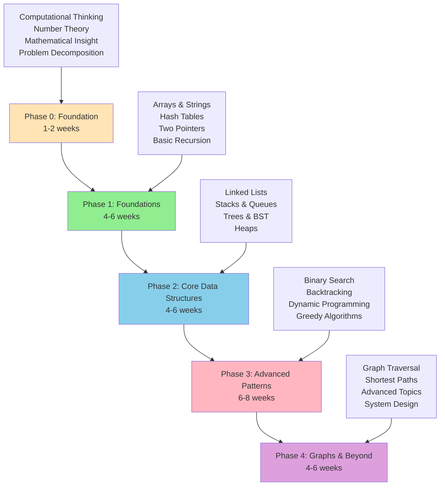

# Algorithm Mastery Roadmap

This roadmap provides a structured path from beginner to advanced algorithmic problem-solving. Follow this progression to build a solid foundation and systematically tackle increasingly complex problems.

## Learning Path Overview

**Total Time**: 19-28 weeks of dedicated study (2-3 hours per day)

**Philosophy**: Master fundamentals before moving to advanced topics. Quality over quantity - deeply understand each problem rather than rushing through many.

---

## Phase 0: Foundation (1-2 weeks)

**Goal**: Build computational thinking and mathematical intuition before diving into data structures.

### What You'll Learn

1. **Computational Thinking**
   - Breaking problems into steps
   - Pattern recognition in sequences
   - Translating math into code

2. **Number Theory Basics**
   - Modular arithmetic
   - Prime numbers and factorization
   - GCD, LCM, divisibility

3. **Mathematical Problem Solving**
   - Arithmetic series formulas
   - Digit manipulation
   - Big integer handling

4. **Optimization Mindset**
   - Brute force vs. formula-based solutions
   - Recognizing when O(1) is possible
   - Search bound analysis

### Recommended Problems (10 Foundation problems)

#### Getting Started (5 problems)

1. **Multiples of 3 or 5** (F001) - Modulo, loops, arithmetic series
2. **Even Fibonacci Numbers** (F002) - Sequence generation
3. **Largest Prime Factor** (F019) - Prime factorization
4. **Sum Square Difference** (F004) - Mathematical formulas
5. **Smallest Multiple** (F003) - LCM/GCD

#### Building Skills (5 problems)

6. **Power Digit Sum** (F006) - Big integers, digit extraction
2. **10001st Prime** (F017) - Prime generation
3. **Number Spiral Diagonals** (F009) - Pattern recognition
4. **Self Powers** (F016) - Modular arithmetic
5. **Highly Divisible Triangular Number** (F020) - Divisor counting

### Phase 0 Tips

- **Focus on understanding**: These problems teach mathematical insight, not data structures
- **Try brute force first**: Then look for the mathematical optimization
- **No complex data structures needed**: Arrays and basic math are sufficient
- **Build intuition**: These patterns appear in harder problems later

### Moving On Criteria

Before advancing to Phase 1, you should be able to:

- Use modular arithmetic comfortably
- Recognize when a formula replaces iteration
- Handle large numbers (big integers)
- Factor numbers and find primes
- Extract and manipulate digits

**Time investment**: 1-2 hours daily, 5-6 days per week

---

## Phase 1: Foundations (4-6 weeks)

**Goal**: Build intuition for basic problem-solving patterns and fundamental data structures.

### What You'll Learn

1. **Arrays and Strings**
   - Index manipulation
   - In-place operations
   - Character/substring operations
   - Edge case handling (empty, single element)

2. **Hash Tables (Maps and Sets)**
   - O(1) lookup for seen elements
   - Counting frequencies
   - Detecting duplicates
   - Anagram detection

3. **Two Pointers Pattern**
   - Left and right pointers converging
   - Fast and slow pointers
   - Sliding window basics
   - Partition algorithms

4. **Basic Recursion**
   - Base cases and recursive cases
   - Call stack understanding
   - Simple tree problems
   - Factorial, Fibonacci patterns

### Recommended Problems (15 foundational problems)

#### Arrays & Strings (5 problems)

1. **Two Sum** (E001) - Hash table for lookups
2. **Valid Anagram** (E095) - Counting with hash maps
3. **Best Time to Buy and Sell Stock** (E051) - Tracking min/max
4. **Move Zeroes** (E108) - In-place array manipulation
5. **Reverse String** (E123) - Two pointers basics

#### Hash Tables (3 problems)

6. **Contains Duplicate** (E083) - Set usage
2. **Group Anagrams** (E026) - Hash map with composite keys
3. **Longest Substring Without Repeating Characters** (M002) - Sliding window + hash set

#### Two Pointers & Sliding Window (4 problems)

9. **Valid Palindrome** (E052) - Two pointers converging
2. **Container With Most Water** (E006) - Two pointers optimization
3. **3Sum** (E010) - Two pointers + sorting
4. **Minimum Size Subarray Sum** (M081) - Sliding window

#### Basic Recursion (3 problems)

13. **Climbing Stairs** (E033) - Simple recursion/DP intro
2. **Pow(x, n)** (M014) - Divide and conquer recursion
3. **Generate Parentheses** (M005) - Backtracking intro

### Phase 1 Tips

- **Don't memorize solutions**: Focus on understanding the "why" behind each approach
- **Time yourself**: Aim for 30-45 minutes per problem initially
- **Code by hand first**: Practice without IDE autocomplete
- **Test edge cases**: Empty inputs, single elements, duplicates, negatives
- **Explain out loud**: If you can't explain it, you don't understand it

### Moving On Criteria

Before advancing to Phase 2, you should be able to:

- Identify when to use hash tables vs arrays
- Recognize two-pointer opportunities
- Write clean recursive functions with proper base cases
- Analyze time/space complexity of your solutions
- Solve 80%+ of Phase 1 problems without hints

**Time investment**: 2-3 hours daily, 5-6 days per week

---

## Phase 2: Core Data Structures (4-6 weeks)

**Goal**: Master essential data structures and their associated algorithms.

### What You'll Learn

1. **Linked Lists**
   - Traversal with dummy nodes
   - Two-pointer techniques (fast/slow)
   - Reversal patterns
   - Cycle detection

2. **Stacks and Queues**
   - LIFO vs FIFO patterns
   - Monotonic stack applications
   - Parentheses matching
   - Using stacks for DFS

3. **Trees and Binary Search Trees**
   - Tree traversals (in-order, pre-order, post-order, level-order)
   - Recursion on trees
   - BST properties
   - Lowest common ancestor

4. **Heaps (Priority Queues)**
   - Min-heap and max-heap
   - Top K problems
   - Merging sorted sequences
   - Python heapq library

### Recommended Problems (20 problems)

#### Linked Lists (5 problems)

1. **Reverse Linked List** (E082) - Fundamental reversal
2. **Merge Two Sorted Lists** (E015) - Two-pointer merging
3. **Linked List Cycle** (E057) - Fast and slow pointers
4. **Remove Nth Node From End** (M004) - Two-pointer with gap
5. **LRU Cache** (H028) - Doubly linked list + hash map

#### Stacks (4 problems)

6. **Valid Parentheses** (E014) - Stack for matching
2. **Min Stack** (E062) - Auxiliary stack technique
3. **Daily Temperatures** (M367) - Monotonic stack
4. **Evaluate Reverse Polish Notation** (E060) - Stack evaluation

#### Trees & BST (7 problems)

10. **Maximum Depth of Binary Tree** (E045) - Basic recursion
2. **Same Tree** (E043) - Tree comparison
3. **Invert Binary Tree** (E086) - Tree transformation
4. **Binary Tree Level Order Traversal** (M039) - BFS with queue
5. **Validate Binary Search Tree** (E042) - BST property checking
6. **Lowest Common Ancestor of BST** (E091) - BST navigation
7. **Kth Smallest Element in BST** (M093) - In-order traversal

#### Heaps (4 problems)

17. **Kth Largest Element in Array** (M085) - Basic heap usage
2. **Top K Frequent Elements** (M149) - Heap + hash map
3. **Find Median from Data Stream** (H042) - Two heaps
4. **Merge K Sorted Lists** (H003) - Heap for merging

### Phase 2 Tips

- **Visualize**: Draw out linked lists and trees on paper
- **Pattern recognition**: Notice when problems share similar structures
- **Master traversals**: In-order, pre-order, post-order should become second nature
- **Dummy nodes**: For linked lists, dummy nodes simplify edge cases
- **Queue vs Stack**: BFS uses queue, DFS uses stack (or recursion)

### Moving On Criteria

Before advancing to Phase 3, you should be able to:

- Implement linked list operations from scratch
- Write all tree traversals (recursive and iterative)
- Choose between stack and queue appropriately
- Use heaps for top K and merging problems
- Recognize when a problem needs a specific data structure

**Time investment**: 2-3 hours daily, 5-6 days per week

---

## Phase 3: Advanced Patterns (6-8 weeks)

**Goal**: Master algorithmic paradigms that power complex problem-solving.

### What You'll Learn

1. **Binary Search Mastery**
   - Search space reduction
   - First/last occurrence
   - Search in rotated arrays
   - Search on answer space

2. **Backtracking**
   - Decision trees and state spaces
   - Pruning strategies
   - Permutations and combinations
   - Constraint satisfaction

3. **Dynamic Programming**
   - Overlapping subproblems
   - Optimal substructure
   - 1D DP (Fibonacci-like)
   - 2D DP (grid, strings)
   - DP on trees and graphs
   - State machine DP

4. **Greedy Algorithms**
   - Greedy choice property
   - Interval scheduling
   - Huffman coding concepts
   - When greedy works vs fails

### Recommended Problems (25 problems)

#### Binary Search (5 problems)

1. **Binary Search** (E220) - Template mastery
2. **Find First and Last Position** (E020) - Modified binary search
3. **Search in Rotated Sorted Array** (M008) - Pivot finding
4. **Find Minimum in Rotated Sorted Array** (M063) - Rotation point
5. **Koko Eating Bananas** (M475) - Binary search on answer

#### Backtracking (6 problems)

6. **Subsets** (E036) - Basic backtracking
2. **Permutations** (E025) - Swap-based backtracking
3. **Combination Sum** (E024) - With repetition allowed
4. **Palindrome Partitioning** (E053) - String partitioning
5. **N-Queens** (H011) - Classic constraint problem
6. **Word Search** (E037) - Backtracking on grid

#### Dynamic Programming - 1D (5 problems)

12. **Climbing Stairs** (E033) - Fibonacci pattern
2. **House Robber** (E077) - Non-adjacent selection
3. **Coin Change** (E119) - Unbounded knapsack
4. **Longest Increasing Subsequence** (M126) - Classic LIS
5. **Decode Ways** (E039) - String DP

#### Dynamic Programming - 2D (6 problems)

17. **Unique Paths** (M022) - Grid DP intro
2. **Longest Common Subsequence** - Two-string DP
3. **Edit Distance** (H014) - Classic DP problem
4. **Maximal Square** (M088) - 2D grid DP
5. **Longest Palindromic Substring** (M003) - Expand from center + DP
6. **Regular Expression Matching** (H002) - Advanced pattern matching

#### Greedy (3 problems)

23. **Jump Game** (E027) - Greedy vs DP comparison
2. **Gas Station** (E054) - Greedy observation
3. **Non-overlapping Intervals** (M193) - Interval scheduling

### Phase 3 Tips

- **DP is hard**: Expect to struggle. That's normal and necessary for growth
- **Start with recursion**: Before optimizing with DP, solve recursively first
- **Identify patterns**: Many DP problems follow templates (knapsack, LCS, LIS)
- **Draw the recurrence**: Visualize state transitions and dependencies
- **Binary search on answer**: This technique appears in unexpected places
- **Backtracking = DFS + undo**: Always restore state after exploring branch

### Moving On Criteria

Before advancing to Phase 4, you should be able to:

- Write binary search without bugs (proper boundary handling)
- Recognize when backtracking is appropriate
- Identify DP problems and formulate recurrence relations
- Convert recursive DP to iterative with tabulation
- Distinguish between greedy and DP problems

**Time investment**: 3-4 hours daily, 5-6 days per week

---

## Phase 4: Graphs & Beyond (4-6 weeks)

**Goal**: Master graph algorithms and prepare for advanced topics.

### What You'll Learn

1. **Graph Traversal**
   - DFS and BFS implementations
   - Adjacency list vs matrix
   - Cycle detection
   - Connected components
   - Bipartite checking

2. **Shortest Paths**
   - BFS for unweighted graphs
   - Dijkstra's algorithm
   - Bellman-Ford algorithm
   - Floyd-Warshall (all-pairs)

3. **Advanced Graph Topics**
   - Topological sort (Kahn's + DFS)
   - Union-Find (Disjoint Set)
   - Minimum spanning tree (Kruskal's, Prim's)
   - Strongly connected components

4. **Beyond Algorithms**
   - Trie (prefix tree)
   - Segment trees (range queries)
   - Bit manipulation tricks
   - Design problems

### Recommended Problems (20 problems)

#### Graph Traversal (6 problems)

1. **Number of Islands** (M077) - DFS/BFS on grid
2. **Clone Graph** (M055) - Graph traversal with cloning
3. **Course Schedule** (M079) - Cycle detection, topological sort
4. **Pacific Atlantic Water Flow** (M180) - Multi-source BFS/DFS
5. **Number of Connected Components** (M136) - Connected components
6. **Graph Valid Tree** (M108) - Tree properties in graph

#### Shortest Paths (4 problems)

7. **Binary Tree Level Order Traversal** (M039) - BFS template
2. **Shortest Path in Binary Matrix** - BFS shortest path
3. **Network Delay Time** (M371) - Dijkstra's algorithm
4. **Cheapest Flights Within K Stops** (M408) - Modified Dijkstra's/BFS

#### Union-Find (3 problems)

11. **Number of Provinces** (M255) - Union-Find application
2. **Redundant Connection** (M329) - Cycle detection with Union-Find
3. **Accounts Merge** (M355) - Merging components

#### Advanced Topics (7 problems)

14. **Implement Trie** (M080) - Trie basics
2. **Word Search II** (H032) - Trie + backtracking
3. **Course Schedule II** (M082) - Topological sort
4. **Min Cost to Connect All Points** - MST with Kruskal's
5. **Single Number** (E055) - XOR bit manipulation
6. **Number of 1 Bits** (E076) - Bit manipulation basics
7. **Design Add and Search Words Data Structure** (M083) - Trie with wildcards

### Phase 4 Tips

- **Graph representation matters**: Choose adjacency list vs matrix based on density
- **BFS for shortest path**: In unweighted graphs, BFS guarantees shortest path
- **DFS for exploration**: When path length doesn't matter, DFS often simpler
- **Union-Find is powerful**: Master this for connectivity problems
- **Draw it out**: Graphs are visual - always sketch the problem
- **Multiple approaches**: Many graph problems have both DFS and BFS solutions

### Moving On Criteria

After completing Phase 4, you should be able to:

- Implement DFS and BFS from scratch
- Choose appropriate graph representation
- Recognize when to use Union-Find vs DFS/BFS
- Implement Dijkstra's algorithm
- Solve topological sort problems
- Use tries for prefix-based problems

**Time investment**: 3-4 hours daily, 5-6 days per week

---

## Beyond the Roadmap

### Next Steps

1. **Advanced Dynamic Programming**
   - DP on trees
   - Bitmask DP
   - Digit DP
   - DP optimizations (monotonic queue, convex hull trick)

2. **Advanced Graph Algorithms**
   - Network flow (Ford-Fulkerson, Dinic's)
   - Strongly connected components (Tarjan's, Kosaraju's)
   - Eulerian path/circuit
   - Traveling salesman variations

3. **Advanced Data Structures**
   - Segment trees and Fenwick trees
   - Suffix arrays and suffix trees
   - Persistent data structures
   - Heavy-light decomposition

4. **System Design**
   - Design distributed systems
   - Caching strategies
   - Load balancing
   - Database sharding

5. **Company-Specific Preparation**
   - Practice on specific company question banks
   - Mock interviews
   - Behavioral interview prep

### Practice Tips

- **Categorize by topic**: Focus on one data structure or algorithm at a time
- **Timed practice**: Simulate interview conditions with time limits
- **Review explanations**: Study optimal solutions after attempting problems
- **Track progress**: Maintain a log of solved problems and patterns learned

---

## General Study Tips

### Daily Routine

**Recommended schedule** (2-3 hours/day):

1. **15 min**: Review yesterday's problems and solutions
2. **45-60 min**: Solve new problem (with timer)
3. **30 min**: Study solution if stuck, understand approach
4. **30 min**: Implement optimal solution, analyze complexity
5. **15 min**: Add to your notes, identify patterns

### Problem-Solving Framework

1. **Understand**: Read carefully, identify inputs/outputs, ask clarifying questions
2. **Examples**: Work through examples by hand, find edge cases
3. **Approach**: Brainstorm multiple approaches, estimate complexity
4. **Plan**: Pseudocode or outline before coding
5. **Implement**: Write clean, readable code
6. **Test**: Test with examples and edge cases
7. **Optimize**: Can you do better in time or space?
8. **Review**: What did you learn? What pattern does this follow?

### When You're Stuck

- **20-minute rule**: Struggle for 20 minutes, then read hints
- **Don't just copy**: Understand the solution, then implement from scratch
- **Return later**: Revisit problem after a few days without looking at solution
- **Explain to others**: Teaching solidifies understanding

### Tracking Progress

- **Maintain a spreadsheet**: Track problems solved, time taken, revisit dates
- **Tag by pattern**: Group problems by technique (two pointers, DP, etc.)
- **Weekly reviews**: Every Sunday, review what you learned
- **Spaced repetition**: Revisit problems after 1 day, 1 week, 1 month

### Dealing with Difficulty Spikes

- **It's normal to struggle**: Advanced topics require multiple attempts
- **Build on fundamentals**: If Phase 3 is too hard, reinforce Phase 2
- **Take breaks**: Your brain consolidates during rest
- **Mix difficulties**: 70% at your level, 20% easier, 10% harder

### Mental Models

1. **Pattern recognition beats memorization**: You can't memorize all problems
2. **Process over outcome**: Focus on approach quality, not just accepting answer
3. **Embrace confusion**: Discomfort means you're learning
4. **Compound learning**: Each problem makes the next one easier

---

## Success Metrics

### After 4-6 Months

You should be able to:

- Solve 70%+ of medium problems independently
- Recognize patterns quickly
- Implement common algorithms from scratch
- Estimate time/space complexity accurately
- Explain your approach clearly

### Interview Readiness Indicators

- Complete 2-3 medium problems in 45 minutes each
- Solve easy problems in 15 minutes
- Identify optimal approach within 10 minutes
- Handle follow-up questions and variations
- Communicate thought process while coding

---

## Motivation & Mindset

### Remember

- **Consistency beats intensity**: 2 hours daily beats 14 hours on weekends
- **Everyone struggles**: Those who succeed kept going when it was hard
- **Progress isn't linear**: Plateaus are normal, breakthroughs come suddenly
- **Interview prep is a marathon**: 4-6 months of focused study is typical

### Celebrate Milestones

- Solved first hard problem
- Completed a full topic (all tree problems)
- Finished a phase
- Beat previous time on revisited problem
- Helped someone else understand a problem

### When to Apply for Jobs

You're ready when:

- Completed Phases 1-3 thoroughly
- Can solve 60%+ of mediums within time limit
- Feel confident in 4-5 data structures/algorithms
- Practiced behavioral questions
- Completed mock interviews

---

## Customization

### If You Have Less Time (2-3 months)

Focus on most common patterns:

- Phase 1: 2 weeks (core problems only)
- Phase 2: 3 weeks (skip LRU cache, advanced heap)
- Phase 3: 4 weeks (focus on DP and binary search)
- Phase 4: 2 weeks (basic graph traversal only)

### If You Have More Time (6-12 months)

- Spend 2x time per phase
- Solve 2-3x the recommended problems
- Implement all algorithms from scratch
- Study theoretical CS (CLRS book)
- Participate in weekly contests

### Based on Your Background

**Strong in recursion**: Spend less time on Phase 1, more on iterative solutions
**Weak in math**: Extra time on problems involving number theory, combinatorics
**Coming from competitive programming**: Skip Phase 1-2, focus on Phases 3-4

---

## Final Thoughts

This roadmap is a guide, not a strict rulebook. Adapt it to your needs, learning style, and timeline. The key is consistent, deliberate practice with deep understanding.

You will struggle. You will get stuck. You will feel overwhelmed. This is the path to mastery. Every expert was once a beginner who refused to give up.

Happy coding, and welcome to your algorithm mastery journey!
